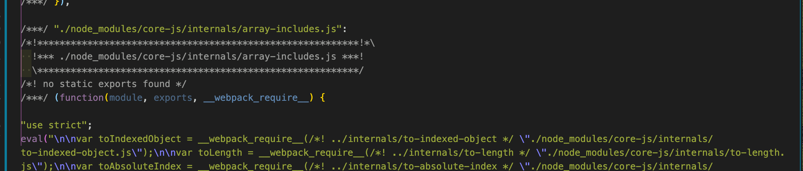

# react-ts-babel-sass-try
仕組みを知るため

## 機能
- ES5にbabel（TypeScript）でトランスパイル
- IE11など1%以上のシェアがあるブラウザと最新から2バージョンまでのブラウザに対応（Polyfill, Prefix）
- TypeScript対応
- SASS（scss）に対応
- cssファイルは外部ファイルに出力
- 自動でCSSのprefixが付く
- 自動HTML生成
- ViewにReactを使用

## 何したのか
1. `webpack webpack-cli webpack-dev-server webpack-merge`をインストール
2. webpackの設定
   1. modeやentryやoutput
   2. resolve.extentionsでmodule解決。相対PATHや絶対PATHをしていしない、モジュール名を使って指定
3. TypeScriptを読み込む & ES5にpolyfill付けてトランスパイルしたいため、`typescript ts-loader @babel/core @babel/preset-env babel-loader core-js@3` をインストール
4. `babel.config.js`や`tsconfig.json`書いたり、webpackで`babel-loader`と`ts-loader`を呼び出したり
5. scssをコンパイルしてcssファイルとして出力したいため、`css-loader node-sass sass-loader mini-css-extract-plugin`をインストール
   1. webpackにcss-loader系を記述し、
6. 自動でprefixが付いてほしいので、`postcss-loader autoprefixer`をインストール
   1. `postcss.config.js`でautoprefixerをimport
   2. `package.json`に`['> 1%', 'last 2 versions']`を指定
7. HTMLもTemplateを読み込んで自動生成したいので、`html-webpack-plugin`をインストール。
8. Reactを入れたいので`react react-dom @types/react @types/react-dom @babel/preset-react`をインストール

## polyfillの確認

webpack devで生成したbundle.jsにcore-jsが含まれている様子

---
多くのブラウザにPolyfillで対応するとファイルサイズが大きくなっていることがわかる。
\ |  `>20%`  |  `> 1% last 2 versions`  |
| ---| ---- | ---- |
| bundle.jsのサイズ(Reactなし) |  2.58 KiB  |  31.9 KiB  |

---
prefixの場合も同様である。
\ |  `指定なし(prefixなし)`  |  `> 1% last 2 versions`  |
| ---| ---- | ---- |
| app.cssのサイズ(Reactなし) |  175 bytes    | 223 bytes

`babel.config.js`ではうまく動かず、`.babelrc`だとpolyfillが効いた